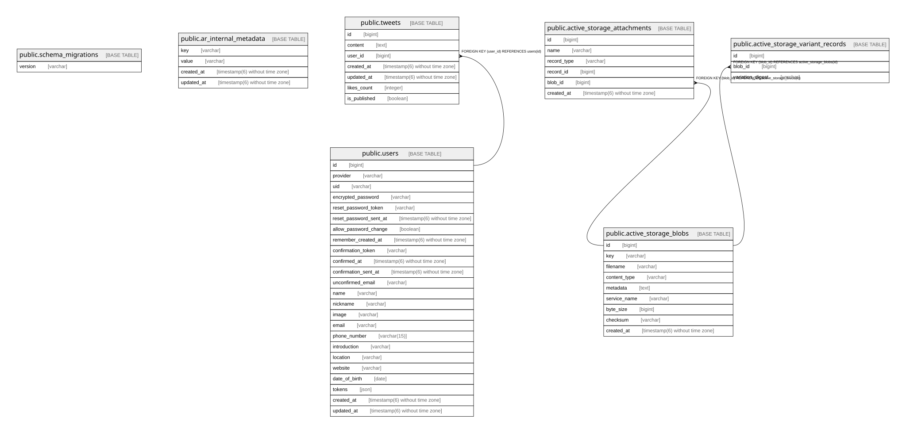

# myapp_test

## Tables

| Name | Columns | Comment | Type |
| ---- | ------- | ------- | ---- |
| [public.schema_migrations](public.schema_migrations.md) | 1 |  | BASE TABLE |
| [public.ar_internal_metadata](public.ar_internal_metadata.md) | 4 |  | BASE TABLE |
| [public.users](public.users.md) | 24 |  | BASE TABLE |
| [public.tweets](public.tweets.md) | 7 |  | BASE TABLE |
| [public.active_storage_blobs](public.active_storage_blobs.md) | 9 |  | BASE TABLE |
| [public.active_storage_attachments](public.active_storage_attachments.md) | 6 |  | BASE TABLE |
| [public.active_storage_variant_records](public.active_storage_variant_records.md) | 3 |  | BASE TABLE |

## Relations

---

> Generated by [tbls](https://github.com/k1LoW/tbls)
